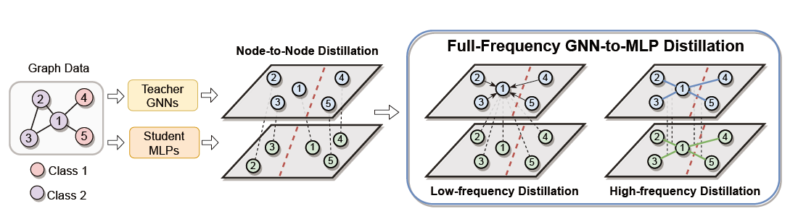

#  Full-Frequency GNN-to-MLP Distillation (FF-G2M)

This is a PyTorch implementation of the Full-Frequency GNN-to-MLP Knowledge Distillation (FF-G2M), and the code includes the following modules:

* Dataset Loader (Cora, Citeseer, Pubmed, Amazon-Photo, Coauthor-CS, and Coauthor-Phy) and data splitting strategy
* Various teacher GNN architectures (GCN, SAGE, GAT) and student MLPs used in this paper
* Training paradigm for teacher GNNs and student MLPs
* Visualization and evaluation metrics 


## Introduction

Recent years have witnessed the great success of Graph Neural Networks (GNNs) in handling graph-related tasks. However, MLPs remain the primary workhorse for practical industrial applications due to their desirable inference efficiency and scalability. To reduce their gaps, one can directly distill knowledge from a well-designed teacher GNN to a student MLP, which is termed as GNN-to-MLP distillation. However, the process of distillation usually entails a loss of information, and "which knowledge patterns of GNNs are more likely to be left and distilled into MLPs?" becomes an important question. In this paper, we first factorize the knowledge learned by GNNs into low- and high-frequency components in the spectral domain and then derive their correspondence in the spatial domain. Furthermore, we identified a potential information drowning problem for existing GNN-to-MLP distillation, i.e., the high-frequency knowledge of the pre-trained GNNs may be overwhelmed by the low-frequency knowledge during distillation; we have described in detail what it represents, how it arises, what impact it has, and how to deal with it. In this paper, we propose an efficient Full-Frequency GNN-to-MLP (FF-G2M) distillation framework, which extracts both low-frequency and high-frequency knowledge from GNNs and injects it into MLPs. Extensive experiments show that FF-G2M improves over the vanilla MLPs by 12.6% and outperforms its corresponding teacher GNNs by 2.6% averaged over six graph datasets and three common GNN architectures.

<p align="center">
  
</p>


## Dependenciesc

* numpy==1.19.2
* scipy==1.3.1
* torch==1.6.0
* dgl == 0.6.1


## Overview

* train_and_eval.py  
  * train_teacher() -- Pre-train the teacher GNNs.
  * train_student() -- Train the student MLPs with the pre-trained teacher GNNs.
* model.py  
  
  * MLP() -- student MLPs
  * GCN() -- GCN Classifier, working as teacher GNNs
  * GAT() -- GAT Classifier, working as teacher GNNs
  * GraphSAGE() -- GraphSAGE Classifier, working as teacher GNNs
  * edge_distribution_low() -- Loss for Low-Frequency Distillation (LFD)
  * edge_distribution_high() -- Loss for High-Frequency distillation (HFD)
* dataloader.py  

  * load_data() -- Load Cora, Citeseer, Pubmed, Amazon-Photo, Coauthor-CS, and Coauthor-Phy datasets and their data splittings.
* utils.py  
  * set_seed() -- Set radom seeds for reproducible results.


## Running the code

1. Install the required dependency packages

3. To get the results on a specific *dataset*, please run with proper hyperparameters:

  ```
python train.py --dataset data_name --ablation_mode mode
  ```

where the *data_name* is one of the six datasets (Cora, Citeseer, Pubmed, Amazon-Photo, Coauthor-CS, and Coauthor-Phy), and *ablation_mode* denotes different experimental settings (0: FF-G2M; 1: vanilla MLPs; 2: GLNN; 3: Low-Frequency Distillation (LFD); 4: High-Frequency distillation (HFD). Use the FF-G2M model with the default optimal hyperparameters on the *Citeseer* dataset as an example: 

```
python main.py --dataset citeseer --ablation_mode 0
```


## Citation

If you find this project useful for your research, please use the following BibTeX entry.

```
@article{wu2023extracting,
  title={Extracting Low-/High-Frequency Knowledge from Graph Neural Networks and Injecting it into MLPs: An Effective GNN-to-MLP Distillation Framework},
  author={Wu, Lirong and Lin, Haitao and Huang, Yufei and Fan, Tianyu and Li, Stan Z},
  journal={arXiv preprint arXiv:2305.10758},
  year={2023}
}
```